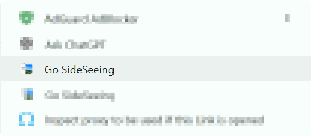
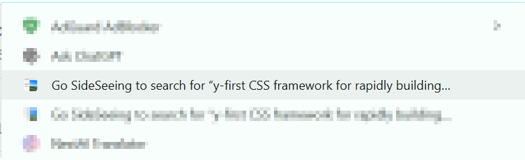

# SideSeeing

  
<strong>Go SideSeeing with your side panel browser.</strong>

  
A beautiful browser inside your browser's side panel.

  

    
  

## Preview

Watch SideSeeing in action.

<video controls src="assets/videos/preview.mp4"></video>
<video controls src="assets/videos/preview_dark.mp4"></video>

## About SideSeeing

SideSeeing turns the right side of your browser into a focused, self-contained browsing space. Its name combines <strong>side browsing</strong> with <strong>sightseeing</strong>: the utility of a compact browser, paired with a calm and scenic experience.

The interface combines macOS-inspired translucent surfaces, soft depth, and rounded controls with familiar keyboard shortcuts for both Windows and macOS. An immersive New Zealand landscape keeps the workspace calm while you check a reference, watch something, or move between pages without covering your main browser tab.

## Features

- **Browse from the side** — open websites without replacing the page in your main browser tab.
- **Multiple tabs** — create, switch, preview, and close independent tabs inside SideSeeing.
- **Unified navigation** — search the web or enter a URL from the same address field.
- **Drag-and-drop links** — drag a link into SideSeeing and release it to open the page in a new SideSeeing tab.
- **Context-menu actions** — open a link in SideSeeing or search selected text without leaving the current page.
- **Quick tab switcher** — filter every open tab, see which one is current, or enter a URL from one searchable panel.
- **Visual tab previews** — hover over a tab to see a live page snapshot, title, and domain before switching.
- **Light and dark themes** — choose a bright daytime landscape or a deeper nighttime workspace.
- **Native-feeling design** — a polished, glassy interface inspired by macOS.

## Installation

SideSeeing is available on the [Chrome Web Store](https://chromewebstore.google.com/detail/sideseeing/cgfpanaponhenddgnffcoohecbaoajhe?hl=en). A Chromium-based browser with side-panel extension support is required; Google Chrome and Microsoft Edge are recommended.

Alternatively, you can install it manually as an unpacked extension:

1. Download the newest SideSeeing `.zip` package from [GitHub Releases](https://github.com/hakadao/SideSeeing-Ext/releases).
2. Extract the downloaded archive to a permanent folder. Do not delete this folder after installation.
3. Open your browser's extensions page:
   - Chrome: `chrome://extensions`
   <!-- - Edge: `edge://extensions` -->
4. Enable **Developer mode**.
5. Select **Load unpacked** and choose the extracted folder that contains `manifest.json`.
6. Pin SideSeeing to the browser toolbar, then click its icon to open it in the side panel.

> [!TIP]
> When updating a manually installed build, replace the extracted files and select **Reload** on the browser's extensions page.

## How to Use

### Browse

Open SideSeeing from its toolbar icon. Enter a search term or URL in either the top address field or the large search field on the New Tab page, then press `Enter`. Use the back, forward, and reload buttons just as you would in a regular browser.

### Open links and search selected text

You can send a link to SideSeeing by dragging it directly into the side panel. When the **Drop link to open** overlay appears, release the link to open it in a new SideSeeing tab.

SideSeeing is also available directly from the browser's right-click menu:

1. **Open a link:** right-click any link and select **Go SideSeeing**. The linked page opens inside SideSeeing while your current page stays in place.
2. **Search selected text:** highlight text on a page, right-click it, and select **Go SideSeeing to search for “…”**. SideSeeing opens the search results in the side panel.

| Open a link in SideSeeing | Search selected text in SideSeeing |
| --- | --- |
|  |  |

### Work with tabs

Use `Ctrl + Alt + T` on Windows or `Command + Option + T` on macOS or click the **+** button to create a tab, then click any tab in the strip to switch to it. The active tab is outlined, while site icons and shortened titles make busy tab strips easy to scan. SideSeeing keeps these pages together in the side panel, separate from your main browser tabs.

### Find a tab quickly

Use `Ctrl + Alt + K` on Windows or `Command + Option + K` on macOS or click the search button beside the tab strip to open the quick switcher. Start typing to filter your open tabs, use the **Current** badge to identify the active page, or enter a URL to navigate directly. Press `Esc` to dismiss the switcher.

### Preview a page

Hover over a tab to see its page snapshot.

### Keyboard access

Use `Ctrl + Alt + L` on Windows or `Command + Option + L` on macOS to focus the address bar from anywhere in SideSeeing. Press `Esc` to close the quick tab switcher on either platform. Keyboard hints are also displayed directly inside the interface.

## Feedback and Support

SideSeeing is still evolving. If you find a bug or have an idea, please [open an issue](https://github.com/hakadao/SideSeeing-Ext/issues).

If you would like to support the project, you can sponsor its development through [GitHub Sponsors](https://github.com/sponsors/hakadao), [Buy Me a Coffee](https://www.buymeacoffee.com/hakadao), or [Afdian](https://afdian.com/a/Hakadao).

---

  Go SideSeeing with your side-panel browser.

